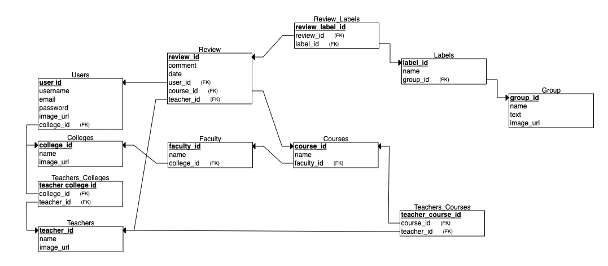
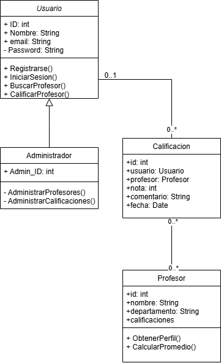

# Descripción del Aplicativo Móvil

El aplicativo móvil "ProfeStats" está diseñado como un sistema interactivo de preguntas y respuestas orientado a calificar a los profesores de manera positiva. Los estudiantes podrán responder a una serie de preguntas rápidas y sencillas que evaluarán aspectos como claridad al explicar, puntualidad, actitud en clase y dominio del tema. Las respuestas estarán enfocadas en destacar las fortalezas del docente, fomentando una retroalimentación constructiva y motivadora.

Al finalizar la evaluación, el aplicativo permitirá al usuario dejar un comentario adicional para el profesor, el cual será presentado de forma respetuosa y con un enfoque positivo. Esta herramienta busca fortalecer la relación entre docentes y estudiantes, promover buenas prácticas docentes y contribuir al mejoramiento continuo en el ámbito educativo a través de la retroalimentación positiva.

- [Configuración del Ambiente de Desarrollo](#configuracion-del-ambiente-de-desarrollo)
- [Diagrama de despliegue](#diagrama-de-despliegue)
- [Requerimientos no Funcionales](#requerimientos-no-funcionales)
- [Requerimientos Funcionales](#requerimientos-funcionales)
- [Diagrama de Casos de Uso](#diagrama-de-casos-de-uso)
- [Diagrama Relacional](#diagrama-relacional)
- [Diagrama de Clases](#diagrama-de-clases)
- [Mockups](#mockups)

## Configuracion del Ambiente de Desarrollo

Paso a paso que se usará en el proyecto.

_<b>Figura 1:</b> Descripción de Android Studio_

<b>Android Studio</b> es el entorno de desarrollo oficial para crear aplicaciones Android. Ofrece un editor de código inteligente, diseño visual de interfaces, emuladores de dispositivos y un sistema de compilación basado en Gradle.

Este se estará usando con el objetivo de emular el dispositivo movil desde el cual podremos probar nuestra aplicación sin necesidad de exportarla. Ademas, al momento de exportar la aplicación este nos podrá proveer con los SDK necesarios para poder hacerlo.

_<b>Figura 2:</b> Descripción de Flutter_

<b>Flutter</b> es un framework de desarrollo de código abierto creado por Google para construir aplicaciones nativas multiplataforma (Android, iOS, web y escritorio) usando un solo código base. Utiliza el lenguaje <b>Dart</b> y destaca por su alta velocidad, su sistema de widgets personalizables y su enfoque en un rendimiento similar al nativo.

Este nos permitirá desarrollar la parte del cliente de la aplicación de manera práctica adaptado para dispositivos Android como iOS.

_<b>Figura 3:</b> Descripción de Ruby_

<b>Ruby on Rails</b> es un framework de desarrollo web basado en el lenguaje Ruby. Facilita la creación de aplicaciones web siguiendo el modelo MVC (Modelo-Vista-Controlador) y promueve el desarrollo rápido mediante convenciones y buenas prácticas.

Usaremos Ruby on Rails para la parte del servidor, creando una API REST que permita a la aplicación móvil Android consultar, enviar y actualizar información. Rails se encargaría de procesar las solicitudes del teléfono, gestionar la lógica de negocio y comunicarse con la base de datos.

_<b>Figura 4:</b> Descripción de SQLite_

<b>SQLite</b> es un motor de base de datos relacional, ligero y autónomo, que almacena los datos en un único archivo local. Funciona sin necesidad de un servidor y es ampliamente utilizado en diversos tipos de aplicaciones donde se requiere una gestión sencilla y eficiente de datos.

Usaremos este motor en el mismo servidor para almacenar los datos tanto de nuestra aplicación como de los usuario que se registren.

## Diagrama de despliegue

_<b>Figura 5:</b> Diagrama de depliegue_

La arquitectura física de la aplicación móvil de evaluación de profesores, donde la aplicación instalada en un teléfono Android consume los servicios REST proporcionados por un servidor Ruby que ejecuta la API Profes. Esta API se encarga de procesar las solicitudes enviadas desde la app, gestionar la lógica de negocio y realizar operaciones de consulta y almacenamiento de datos en una base de datos local Profe.db basada en SQLite3, asegurando una comunicación eficiente entre los componentes.

## Requerimientos No Funcionales

A continuación se presentarán los requerimientos no funcionales para la arquitectura descrita en el diagrama anterior visto. Coonsiderando que se usará Flutter para el desarrollo del proyecto.

### 1. Rendimiento

La aplicación debe iniciar en menos de 3 segundos en dispositivos Android con al menos 2GB de RAM.

### 2. Compatibilidad multiplataforma:

La app desarrollada en Flutter debe ser compatible tanto con Android como con iOS, sin pérdida de funcionalidades o experiencia de usuario.

### 3. Disponibilidad:

El sistema backend desplegado en Azure debe estar disponible el 99.9% del tiempo, permitiendo el acceso constante a la API.

### 4. Escalabilidad:

El sistema debe ser capaz de manejar al menos 1,000 usuarios simultáneos sin pérdida significativa de rendimiento.

### 5. Seguridad:

Toda comunicación entre la app móvil, el panel web y la API debe realizarse mediante el protocolo HTTPS para proteger la información.

### 6. Usabilidad:

La interfaz móvil debe ser intuitiva y estar diseñada con prácticas de UX modernas, facilitando su uso a estudiantes sin capacitación previa.

### 7. Almacenamiento local temporal:

La aplicación debe poder guardar las respuestas de forma local en caso de pérdida de conexión, y sincronizarlas cuando se recupere el acceso a internet.

### 8.Consumo eficiente de recursos:

La aplicación debe minimizar el uso de batería y memoria, asegurando que no consuma más del 5% de recursos en segundo plano.

## Requerimientos Funcionales

A continuación se presentarán los requerimientos funcionales para la arquitectura descrita en el diagrama anterior visto. Coonsiderando que se usará Flutter para el desarrollo del proyecto.

### 1. Registro de Usuario

-El usuario podrá registrarse en el sistema proporcionando los datos requeridos (nombre, correo electrónico, contraseña).

### 2. Inicio de Sesión:

-Los usuarios deberán iniciar sesión con sus credenciales (correo electrónico y contraseña) para acceder al sistema.

### 3. Búsqueda de Profesor:

-Los usuarios podrán buscar profesores en el sistema utilizando filtros como nombre, materia, universidad.

### 4. Perfil del Profesor:

-Los usuarios podrán acceder al perfil de un profesor para ver más detalles, incluyendo las reseñas anteriores, materias que enseña, etc.

### 5. Calificación de Profesor:

-Los estudiantes podrán calificar a los profesores en diferentes criterios mediante una encuesta sencilla que calculara la puntualidad, claridad, y dominio de la materia.

### 6. Administrar Profesores:

-Los administradores podrán gestionar los datos de los profesores, editando sus perfiles, actualizando información y gestionando sus calificaciones

### 7. Administrar Calificaciones:

-Los administradores tendrán la capacidad de supervisar y gestionar las calificaciones y comentarios dados por los estudiantes.

## Diagrama de Casos de Uso

_<b>Figura 6:</b> Diagrama de Casos de uso_

El diagrama de casos de uso representa las principales funcionalidades de la aplicación "ProfeStats" de evaluación positiva de profesores. En él, el usuario puede registrarse, iniciar sesión, buscar profesores, consultar el perfil de un profesor y calificarlo mediante una encuesta basada en criterios de puntualidad, claridad y dominio de la materia. Por otro lado, el administrador tiene acceso a funcionalidades específicas para administrar profesores y gestionar calificaciones y comentarios.

## Diagrama Relacional

_<b>Figura 7:</b> Diagrama Relacional_

Este diagrama muestra la estructura de base de datos que soportará la aplicación. Define cómo se almacenan y relacionan los datos de usuarios, profesores, cursos, reseñas y niveles de satisfacción. Cada tabla representa una entidad clave como los usuarios o profesores, y las líneas indican las relaciones entre ellas, principalmente usando llaves foráneas (FK). Esto permitirá que la app registre evaluaciones positivas de profesores de manera organizada, asocie comentarios, calificaciones y cursos, y relacione cada evaluación con etiquetas y niveles de satisfacción.

## Diagrama de Clases

_<b>Figura 8:</b> Diagrama de Clases_

Este diagrama describe la estructura lógica y funcional de la aplicación desde el punto de vista de la programación. Define clases como el Usuario, Administrador, Profesor y Calificacion, etc. Estas clases están junto con sus respectivos atributos y métodos. También se muestran las relaciones entre las clases como por ejemplo:
Un Usuario puede hacer múltiples Calificaciones y un Profesor puede recibir varias Calificaciones.

## Mockups

|                                                                                                                                                              Mockup                                                                                                                                                              | Descripción                                                                                                                                                                                                                                                                                                                                                                                                                                                                                                                                                                                                                                                                                       |
| :------------------------------------------------------------------------------------------------------------------------------------------------------------------------------------------------------------------------------------------------------------------------------------------------------------------------------: | :------------------------------------------------------------------------------------------------------------------------------------------------------------------------------------------------------------------------------------------------------------------------------------------------------------------------------------------------------------------------------------------------------------------------------------------------------------------------------------------------------------------------------------------------------------------------------------------------------------------------------------------------------------------------------------------------ |
|                                                                                                                        **Pantalla de Registro (Sign In)**                                                                                                                          | La pantalla de **Registro** permite a nuevos usuarios crear una cuenta en _ProfeStats_.   Incluye los siguientes campos: - **Correo electrónico**: Campo para ingresar un correo válido. - **Contraseña**: Campo para definir una contraseña segura. - **Confirmar contraseña**: Campo para confirmar la contraseña ingresada.  Además, cuenta con un botón **Registrarse** para completar el proceso de creación de cuenta.                                                                                                                                                                                                                                                 |
|                                                                                                                    **Pantalla de Inicio de Sesión (Log In)**                                                                                                                       | La pantalla de **Inicio de Sesión** permite a los usuarios existentes ingresar a su cuenta en _ProfeStats_.   Incluye los siguientes campos: - **Correo electrónico**: Campo para ingresar el correo registrado. - **Contraseña**: Campo para ingresar la contraseña correspondiente.  Cuenta con un botón **Iniciar Sesión** para acceder a la aplicación.                                                                                                                                                                                                                                                                                                                     |
|                                                           **Página Principal - Buscar Universidades o Profesores**                                                               | La **Página Principal** permite al usuario buscar universidades o profesores para calificarlos o consultar sus evaluaciones.   Incluye: - **Barra de búsqueda**: Permite buscar universidades o profesores por nombre. - **Tabs "Universidades" y "Profesores"**: Cambian la vista para mostrar ya sea una lista de universidades o de profesores destacados. - **Listado de resultados**: Muestra nombres, fotos y número de calificaciones de cada universidad o profesor.  También incorpora un **menú de navegación inferior** con accesos rápidos.                                                                                                                      |
|                                                   **Página de Universidad - Buscar Profesores o Curso**                                                       | Al seleccionar una universidad, se muestra la **Página de Detalle de Universidad** enfocada en profesores.   Incluye: - **Nombre y logo de la universidad** en la parte superior. - **Barra de búsqueda**: Para buscar profesores o cursos dentro de esa universidad. - **Tabs "Profesores" y "Cursos"**: Permiten alternar entre profesores y los cursos disponibles.  - **Listado de profesores** mostrando nombre, foto y número de calificaciones.  - **Listado de cursos** ofrecidos, cada uno representado con un ícono de color.                                                                                                                                      |
|                                                                                                                   **Profesores por curso**                                                                                                                      | Al seleccionar un curso, el usuario es redirigido a esta interfaz que muestra una **lista de profesores** que han impartido ese curso.  Cada profesor está identificado por su **foto de perfil**, **nombre** y el **número de calificaciones** recibidas.                                                                                                                                                                                                                                                                                                                                                                                                                                     |
|                                                                                                                           **Perfil de Alumno**                                                                                                                               | Muestra la página de **perfil del alumno** donde se puede ver: - **Foto, nombre y universidad** del alumno. - **Historial de calificaciones** que el alumno ha realizado.                                                                                                                                                                                                                                                                                                                                                                                                                                                                                                                   |
|                                                                                                                           **Perfil de Profesor**                                                                                                                              | Vista del **perfil de un profesor**, donde se puede consultar: - **Foto, nombre y universidad** donde enseña. - **Etiquetas** que describen características del profesor, **obtenidas a partir de las calificaciones de los alumnos** (por ejemplo: "Organizado", "Práctico", "Dinámico"). - **Sección de reseñas**, donde los alumnos han dejado comentarios breves acompañados de **íconos** relacionados con la calificación otorgada. Al **presionar sobre una reseña**, se muestra un **resumen detallado** de la calificación dada. - **Botón para calificar al profesor**.                                                                                                  |
| **Proceso de Calificación de Profesor**       | El flujo para calificar a un profesor se compone de varias pantallas secuenciales:  **1. Elige el curso** El usuario selecciona el curso en el que tuvo al profesor a calificar.  **2. Claridad de la explicación** Pregunta al usuario "¿Qué tan claro explica el profesor?" con opciones como: - Muy claro - Claro - Algo claro - Un poco claro  **3. Calificación general** Pregunta "En general, ¿qué calificación le darías al profesor?" con opciones de: - Excelente - Buena - Regular - Mala  **4. Añadir un comentario (opcional)** Permite escribir una reseña adicional sobre el profesor antes de enviar la calificación. |

Vista completa del Mockup: https://www.figma.com/design/5XnSycx9FiWNkJUkTclBnf/Interfaces?node-id=0-1&p=f&t=reZS3X4rwvd8olXb-0
