# Descripción del Aplicativo Móvil

Este aplicativo móvil está diseñado como un sistema interactivo de preguntas y respuestas orientado a calificar a los profesores de manera positiva. Los estudiantes podrán responder a una serie de preguntas rápidas y sencillas que evaluarán aspectos como claridad al explicar, puntualidad, actitud en clase y dominio del tema. Las respuestas estarán enfocadas en destacar las fortalezas del docente, fomentando una retroalimentación constructiva y motivadora.

Al finalizar la evaluación, el aplicativo permitirá al usuario dejar un comentario adicional para el profesor, el cual será presentado de forma respetuosa y con un enfoque positivo. Esta herramienta busca fortalecer la relación entre docentes y estudiantes, promover buenas prácticas docentes y contribuir al mejoramiento continuo en el ámbito educativo a través de la retroalimentación positiva.

- [Configuración del Ambiente de Desarrollo](#configuracion-del-ambiente-de-desarrollo)
- [Diagrama de despliegue](#diagrama-de-despliegue)
- [Requerimientos no Funcionales](#requerimientos-no-funcionales)
- [Diagrama de Claes](#diagrama-de-clases)

## Configuracion del Ambiente de Desarrollo

Paso a paso que se usará en el proyecto.

*<b>Figura 1:</b> Instalación de Android Studio*

## Diagrama de despliegue

*<b>Figura 2:</b> Diagrama de depliegue*
La arquitectura física del sistema móvil. En él se muestra cómo la aplicación móvil, instalada en un teléfono Android, consume los servicios REST proporcionados por una API desplegada en Microsoft Azure. Esta API gestiona las solicitudes tanto desde la app como desde un panel web utilizado por los profesores para visualizar comentarios. Además, la API se conecta a una base de datos SQLite3 donde se consultan y almacenan las calificaciones y opiniones emitidas por los estudiantes.

## Requerimientos No Funcionales

A continuación se presentarán los requerimientos no funcionales para la arquitectura descrita en el diagrama anterior visto. Coonsiderando que se usará Flutter para el desarrollo del proyecto.

### 1. Rendimiento
La aplicación debe iniciar en menos de 3 segundos en dispositivos Android con al menos 2GB de RAM.

### 2. Compatibilidad multiplataforma:
La app desarrollada en Flutter debe ser compatible tanto con Android como con iOS, sin pérdida de funcionalidades o experiencia de usuario.

### 3. Disponibilidad:
El sistema backend desplegado en Azure debe estar disponible el 99.9% del tiempo, permitiendo el acceso constante a la API.

### 4. Escalabilidad:
El sistema debe ser capaz de manejar al menos 1,000 usuarios simultáneos sin pérdida significativa de rendimiento.

### 5. Seguridad:
Toda comunicación entre la app móvil, el panel web y la API debe realizarse mediante el protocolo HTTPS para proteger la información.

### 6. Usabilidad:
La interfaz móvil debe ser intuitiva y estar diseñada con prácticas de UX modernas, facilitando su uso a estudiantes sin capacitación previa.

### 7. Almacenamiento local temporal:
La aplicación debe poder guardar las respuestas de forma local en caso de pérdida de conexión, y sincronizarlas cuando se recupere el acceso a internet.

### 8.Consumo eficiente de recursos:
La aplicación debe minimizar el uso de batería y memoria, asegurando que no consuma más del 5% de recursos en segundo plano.

## Requerimientos Funcionales

A continuación se presentarán los requerimientos no funcionales para la arquitectura descrita en el diagrama anterior visto. Coonsiderando que se usará Flutter para el desarrollo del proyecto.

### 1. Registro de Usuario
 -El usuario podrá registrarse en el sistema proporcionando los datos requeridos (nombre, correo electrónico, contraseña).
 

### 2. Inicio de Sesión:
-Los usuarios deberán iniciar sesión con sus credenciales (correo electrónico y contraseña) para acceder al sistema.

### 3. Búsqueda de Profesor:
-Los usuarios podrán buscar profesores en el sistema utilizando filtros como nombre, materia, universidad.

### 4. Perfil del Profesor:
-Los usuarios podrán acceder al perfil de un profesor para ver más detalles, incluyendo las reseñas anteriores, materias que enseña, etc. 

### 5. Calificación de Profesor:
-Los estudiantes podrán calificar a los profesores en diferentes criterios mediante una encuesta sencilla que calculara la puntualidad, claridad, y dominio de la materia.

### 6. Administrar Profesores:
-Los administradores podrán gestionar los datos de los profesores, editando sus perfiles, actualizando información y gestionando sus calificaciones

### 7. Administrar Calificaciones:
-Los administradores tendrán la capacidad de supervisar y gestionar las calificaciones y comentarios dados por los estudiantes.

## Diagrama de clases

## Mockups

| Imagen | Descripción |
|:------:|:------------|
|**Pantalla de Registro (Sign In)**   |La pantalla de **Registro** permite a nuevos usuarios crear una cuenta en *ProfeStats*.   Incluye los siguientes campos: - **Correo electrónico**: Campo para ingresar un correo válido. - **Contraseña**: Campo para definir una contraseña segura. - **Confirmar contraseña**: Campo para confirmar la contraseña ingresada.  Además, cuenta con un botón **Registrarse** para completar el proceso de creación de cuenta. |
| **Pantalla de Inicio de Sesión (Log In)**   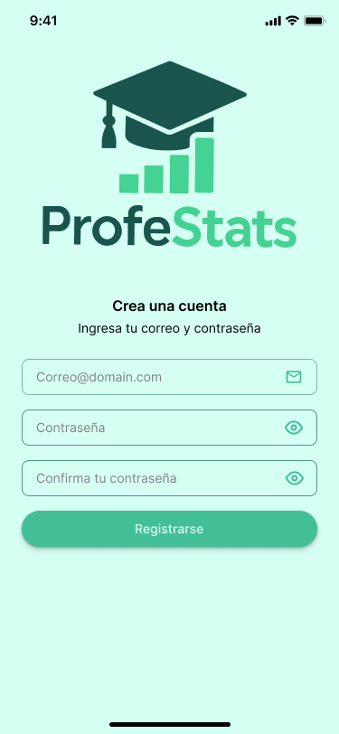|La pantalla de **Inicio de Sesión** permite a los usuarios existentes ingresar a su cuenta en *ProfeStats*.   Incluye los siguientes campos: - **Correo electrónico**: Campo para ingresar el correo registrado. - **Contraseña**: Campo para ingresar la contraseña correspondiente.  Cuenta con un botón **Iniciar Sesión** para acceder a la aplicación. |
| **Página Principal - Buscar Universidades o Profesores**   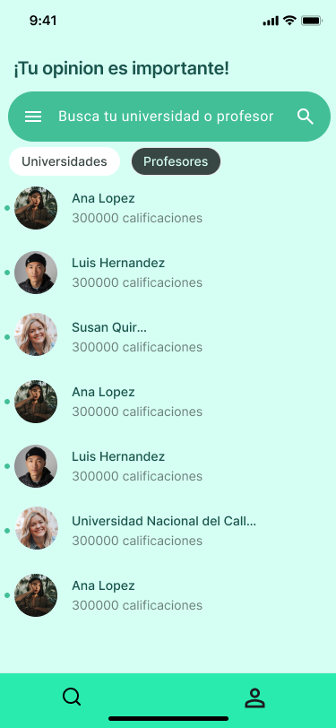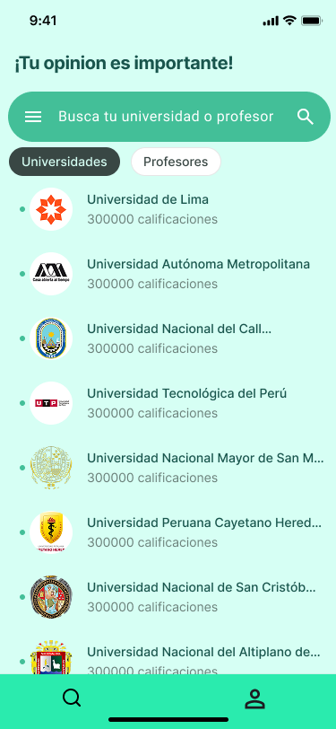 | La **Página Principal** permite al usuario buscar universidades o profesores para calificarlos o consultar sus evaluaciones.   Incluye: - **Barra de búsqueda**: Permite buscar universidades o profesores por nombre. - **Tabs "Universidades" y "Profesores"**: Cambian la vista para mostrar ya sea una lista de universidades o de profesores destacados. - **Listado de resultados**: Muestra nombres, fotos y número de calificaciones de cada universidad o profesor.  También incorpora un **menú de navegación inferior** con accesos rápidos. |**Página de Universidad - Buscar Profesores o Curso**   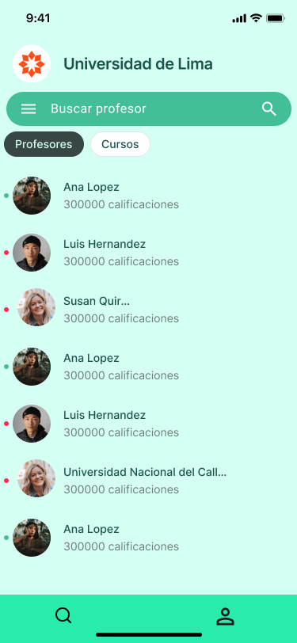 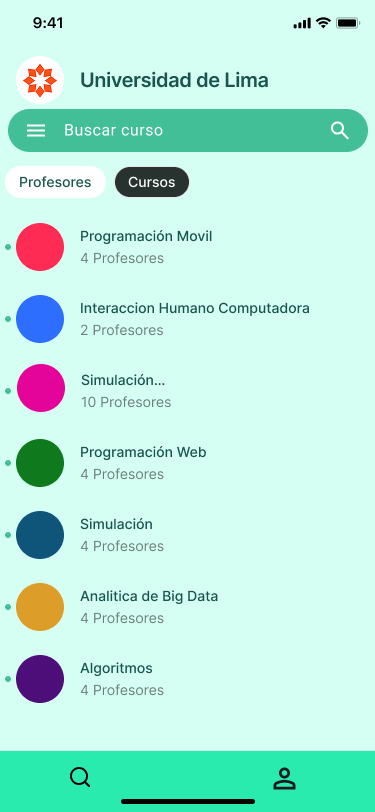 | Al seleccionar una universidad, se muestra la **Página de Detalle de Universidad** enfocada en profesores.   Incluye: - **Nombre y logo de la universidad** en la parte superior. - **Barra de búsqueda**: Para buscar profesores o cursos dentro de esa universidad. - **Tabs "Profesores" y "Cursos"**: Permiten alternar entre profesores y los cursos disponibles.  - **Listado de profesores** mostrando nombre, foto y número de calificaciones.  - **Listado de cursos** ofrecidos, cada uno representado con un ícono de color. |
|**Perfil de Alumno**   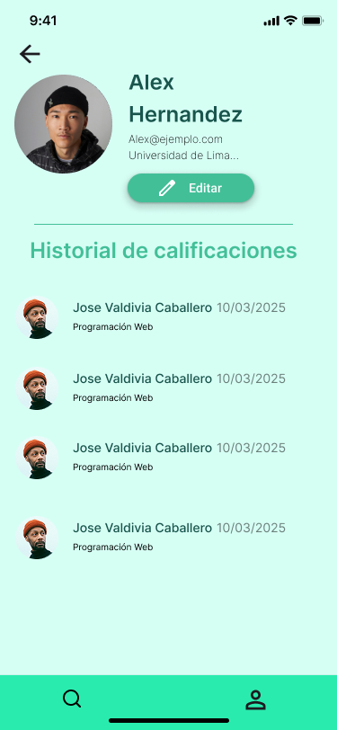 | Muestra la página de **perfil del alumno** donde se puede ver: - **Foto, nombre y universidad** del alumno. - **Historial de calificaciones** que el alumno ha realizado. |
|**Perfil de Profesor**   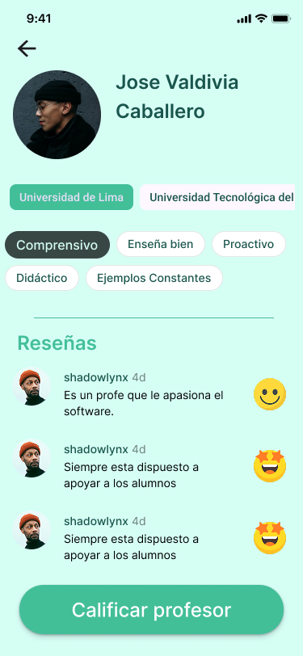	 |  Vista del **perfil de un profesor**, donde se puede consultar: - **Foto, nombre y universidad** donde enseña. - **Etiquetas** que describen características del profesor, **obtenidas a partir de las calificaciones de los alumnos** (por ejemplo: "Organizado", "Práctico", "Dinámico"). - **Sección de reseñas**, donde los alumnos han dejado comentarios breves acompañados de **íconos** relacionados con la calificación otorgada. Al **presionar sobre una reseña**, se muestra un **resumen detallado** de la calificación dada. - **Botón para calificar al profesor**. 
|**Proceso de Calificación de Profesor**   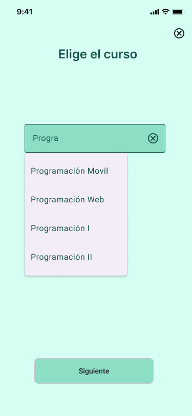 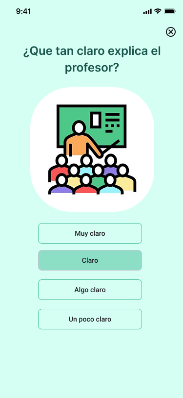 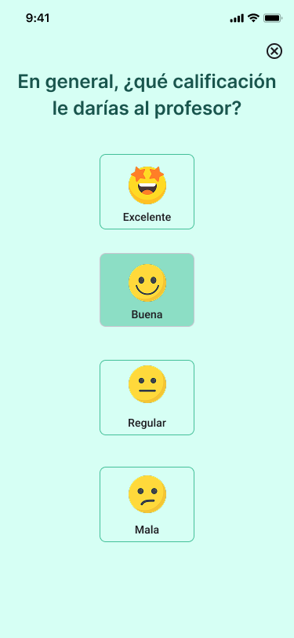 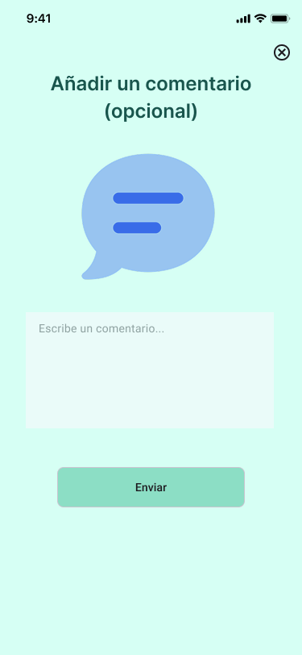| El flujo para calificar a un profesor se compone de varias pantallas secuenciales:  **1. Elige el curso** El usuario selecciona el curso en el que tuvo al profesor a calificar.  **2. Claridad de la explicación** Pregunta al usuario "¿Qué tan claro explica el profesor?" con opciones como: - Muy claro - Claro - Algo claro - Un poco claro  **3. Calificación general** Pregunta "En general, ¿qué calificación le darías al profesor?" con opciones de: - Excelente - Buena - Regular - Mala  **4. Añadir un comentario (opcional)** Permite escribir una reseña adicional sobre el profesor antes de enviar la calificación. |

